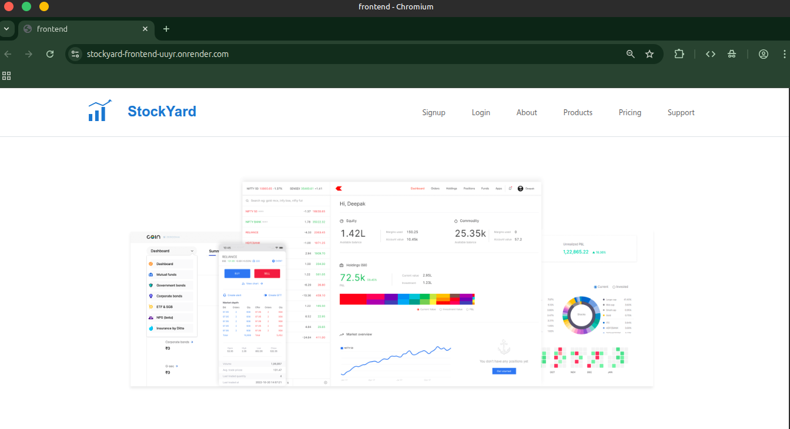
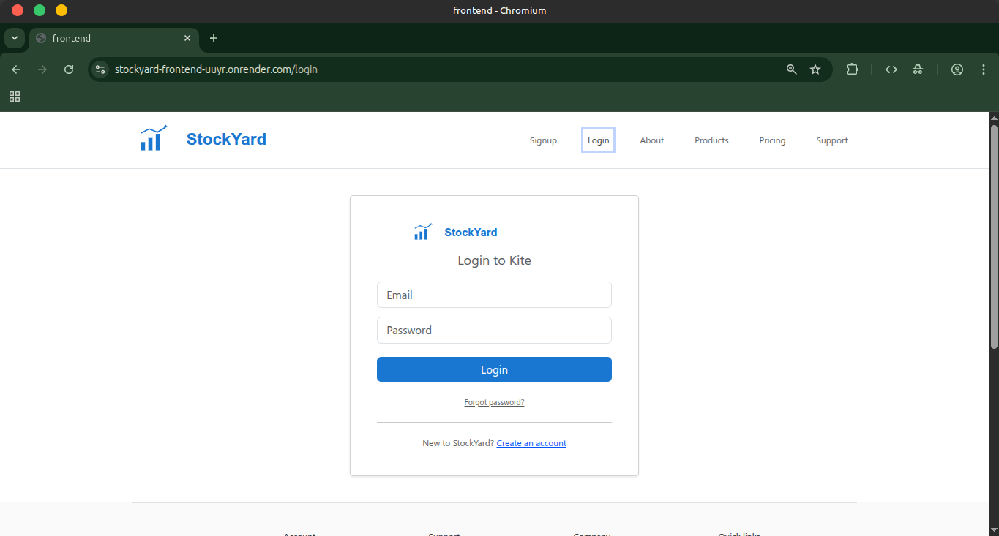
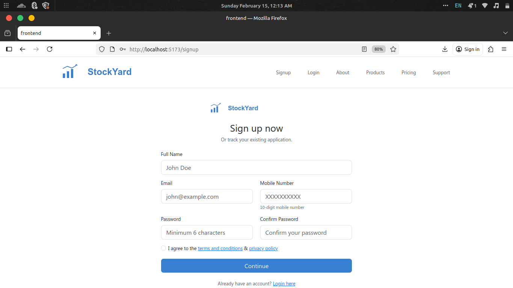
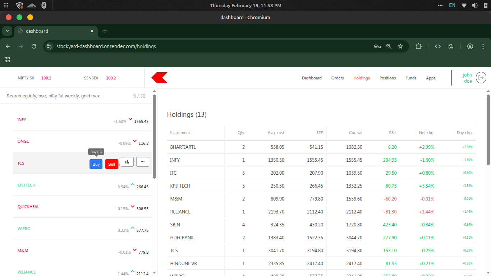

# 📈 StockYard – Full Stack Trading Platform

StockYard is a full-stack trading platform inspired by Zerodha.  
It includes authentication, protected dashboard, and full production deployment.

---

## 🚀 Live Demo

- 🌐 Frontend: https://stockyard-frontend-uuyr.onrender.com
- 📊 Dashboard: https://stockyard-dashboard.onrender.com
- 🔐 Backend API: https://stockyard-backend-o8uo.onrender.com

---

## 🛠 Tech Stack

### Frontend
- React (Vite)
- React Router
- Axios
- Bootstrap

### Dashboard
- React
- Material UI
- Chart.js

### Backend
- Node.js
- Express.js
- MongoDB Atlas
- JWT Authentication

### Deployment
- Render
- MongoDB Atlas

---

## ✨ Features

- User Signup & Login
- JWT Authentication
- Protected Routes
- Trading Dashboard
- Holdings & Positions
- Order Placement

---

## 📷 Screenshots

### Landing Page


### Login Page



### Sign up Page


### Dashboard


---

## ⚙️ Local Setup

### Clone the repository

```bash
git clone https://github.com/Piyush467/Stock-yard.git
cd Stock-yard
