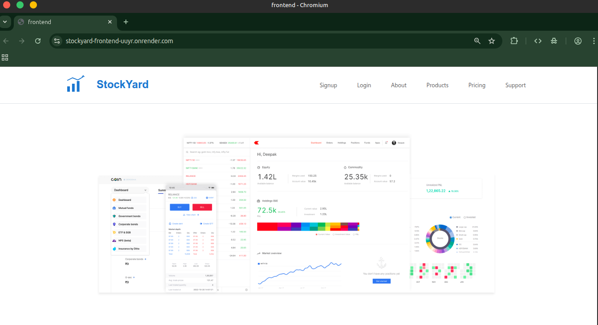
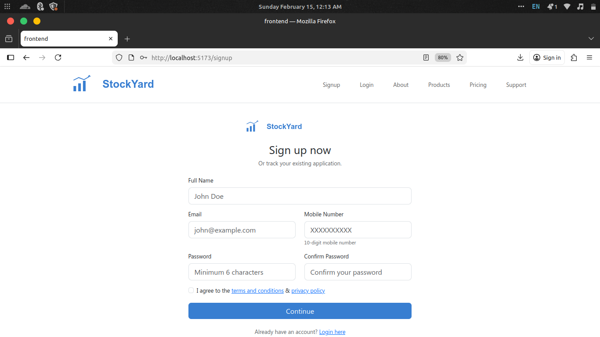
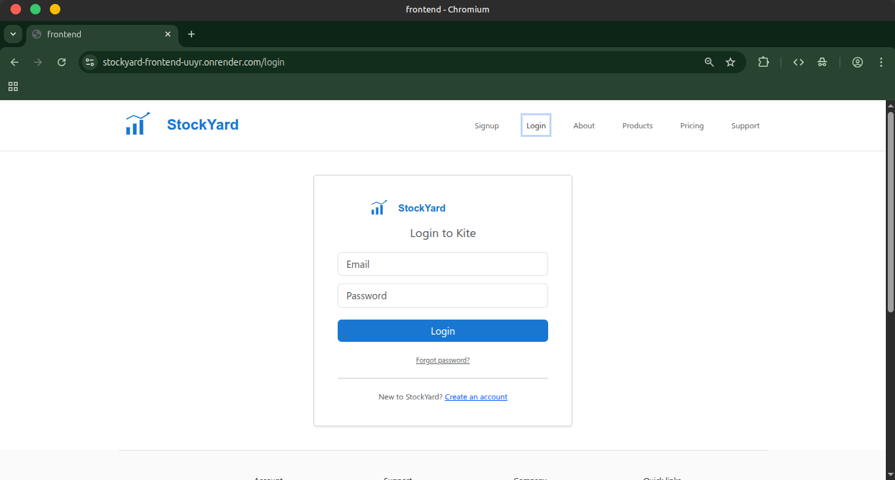
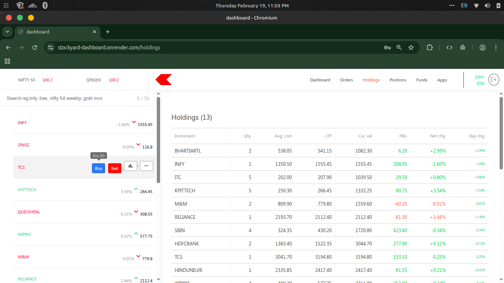

# <p align="center">📈 StockYard – Full-Stack Trading Platform</p>

<p align="center">
  
  
  
  
  
  
  
  
  
</p>

StockYard is a high-performance, full-stack trading and portfolio management platform inspired by the Zerodha interface. The ecosystem consists of three major components: a public landing platform, an administrative/trading dashboard, and a secure REST API backend.

---


## 📸 Application Previews

<details open>
  <summary><b>📺 Click to toggle screenshots</b></summary>
  <br/>
  
  ### 🌐 Landing Page
  *Clean, interactive home page mirroring Zerodha's minimalistic user interface.*
  
  
  ### 🔐 Authentication Flow
  *Secure signup and login pages with real-time field validation.*
  
  | Sign Up Page | Login Page |
  | :---: | :---: |
  |  |  |
  
  ### 📊 Trading Dashboard
  *Interactive watchlist, portfolio summary, positions table, order history, and graphical holdings visualizations.*
  
</details>

---

## ✨ Features

- **🔐 Robust JWT Authentication:** Secured with HTTP-only cookies enabling cross-site session persistence.
- **📈 Real-time Portfolio Metrics:** Computes overall investments, live valuation, daily net change, and unrealized profit & loss (P&L) dynamically.
- **🔍 Searchable Watchlist:** Search and track listed equities with action menus to buy, sell, or view charts upon hover.
- **📊 Interactive Charts:** Integrates Chart.js (via `react-chartjs-2`) for dynamic vertical bar graphs representing stock prices and holdings.
- **🛡️ Backend Security Architecture:**
  - **CORS Protection:** Configured with specific domain whitelisting.
  - **Helmet Headers:** Secures HTTP headers to mitigate vulnerabilities.
  - **IP Rate Limiting:** Mitigates brute-force attacks on sensitive API endpoints.
  - **NoSQL Injection Defense:** Sanitizes query parameters and bodies to remove MongoDB query operator prefixes (`$`).
  - **Cross-Site Scripting (XSS) Prevention:** Filters user inputs to block malicious scripting payloads.

---

## 📁 Repository Structure

```text
Stockyard/
├── backend/                  # REST API server (Node & Express)
│   ├── controllers/          # Business logic handlers (auth, user profiles)
│   ├── middleware/           # Security, authentication, and error validation
│   ├── model/                # Mongoose models (User, Holdings, Positions, Orders)
│   ├── routes/               # API endpoint routing declarations
│   ├── schemas/              # MongoDB database document definitions
│   ├── utils/                # Token generation helpers
│   └── index.js              # Entrypoint server script
│
├── frontend/                 # Public Landing Platform (React + Vite + Bootstrap)
│   ├── src/
│   │   ├── landing_page/     # Multi-page landing sections (Home, About, Pricing, Support)
│   │   ├── context/          # Global Authentication contexts
│   │   └── services/         # API HTTP communication client wrappers
│   └── index.html            # Main SPA wrapper
│
└── dashboard/                # Trading & Investment Portal (React + Vite + Material-UI)
    ├── src/
    │   ├── components/       # Watchlist, holdings, graphs, funds, order forms
    │   ├── context/          # UI state contexts
    │   └── data/             # Stock watchlist database configurations
    └── index.html            # Trading portal SPA wrapper
```

---

## ⚙️ Local Setup Guide

Follow these steps to run the complete StockYard suite locally:

### 1. Prerequisites
- [Node.js](https://nodejs.org/) installed (v18+ recommended)
- A running [MongoDB Local Instance](https://www.mongodb.com/try/download/community) or a [MongoDB Atlas Cluster](https://www.mongodb.com/cloud/atlas)

### 2. Clone the Repository
```bash
git clone https://github.com/Piyush467/Stock-yard.git
cd Stock-yard
```

### 3. Backend Setup
1. Navigate to the backend directory:
   ```bash
   cd backend
   ```
2. Install dependencies:
   ```bash
   npm install
   ```
3. Create a `.env` file in the `backend/` root directory:
   ```env
   MONGO_URL=your_mongodb_connection_string
   PORT=3002
   JWT_SECRET=your_jwt_secret_key
   JWT_EXPIRE=7d
   NODE_ENV=development
   FRONTEND_URL=http://localhost:5173
   DASHBOARD_URL=http://localhost:5174
   ```
4. Start the backend server:
   ```bash
   npm start
   ```
   *The server will run on `http://localhost:3002` with Nodemon monitoring for changes.*

### 4. Frontend Landing Setup
1. Open a new terminal and navigate to the frontend directory:
   ```bash
   cd frontend
   ```
2. Install dependencies:
   ```bash
   npm install
   ```
3. Start the development server:
   ```bash
   npm run dev
   ```
   *The application will boot up at `http://localhost:5173`.*

> [!NOTE]
> For local environments, change the backend API server base URL in `frontend/src/services/authService.js` to point to your local backend endpoint (`http://localhost:3002/api/auth`).

### 5. Trading Dashboard Setup
1. Open a new terminal and navigate to the dashboard directory:
   ```bash
   cd dashboard
   ```
2. Install dependencies:
   ```bash
   npm install
   ```
3. Start the dashboard development server:
   ```bash
   npm run dev
   ```
   *The dashboard will run on `http://localhost:5174`.*

> [!NOTE]
> For local environments, change the backend API server base URL in `dashboard/src/services/authService.js` and all API paths in component files (e.g. `Holdings.jsx`, `Positions.jsx`, etc.) to point to your local backend endpoint (`http://localhost:3002`).

---

## 🔌 API Documentation

All protected endpoints expect a valid JWT cookie set via the login route.

### 🔓 Public Auth Endpoints
* **`POST /api/auth/register`** - Create a new trading account.
  * *Body Payload:*
    ```json
    {
      "name": "John Doe",
      "email": "john@example.com",
      "password": "securepassword123",
      "phone": "9876543210"
    }
    ```
* **`POST /api/auth/login`** - Authenticate user and issue cookie token.
  * *Body Payload:*
    ```json
    {
      "email": "john@example.com",
      "password": "securepassword123"
    }
    ```

### 🔐 Protected Dashboard Endpoints
* **`GET /api/auth/me`** - Fetch current user account information.
* **`POST /api/auth/logout`** - Invalidate active session tokens and clear credentials cookie.
* **`GET /allHoldings`** - Retrieve array of user portfolio holdings.
* **`GET /allPositions`** - Fetch open positions and trades.
* **`POST /newOrder`** - Log a new buying or selling action.
  * *Body Payload:*
    ```json
    {
      "name": "INFY",
      "qty": 5,
      "price": 1555.45,
      "mode": "BUY"
    }
    ```

---

## 🛠 Tech Stack Details

* **Frontend Engine:** React, React Router v7, Axios Client, Bootstrap 5.
* **Dashboard Engine:** Material-UI (MUI v7), React ChartJS 2, Axios.
* **Backend Framework:** Node.js, Express.js (v5), Mongoose ODM.
* **Security Modules:** Helmet security context headers, Express rate limiter, MongoDB sanitize middleware, XSS sanitization.
* **Database & Hosting:** MongoDB Atlas cloud cluster database, Render hosting pipelines.
